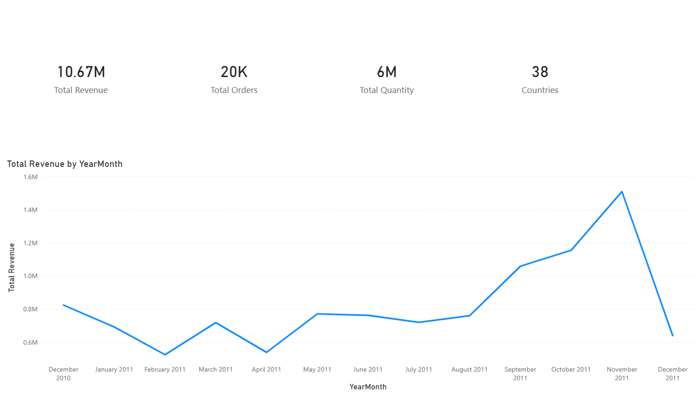

# Online Retail Sales Analysis 📊

This project explores transactional sales data from an online retail store.  
The goal was to understand how the business performs, identify revenue trends,
and see which products and markets generate the most sales.

The analysis was done using Python for data cleaning and exploration,
and Power BI to create a simple interactive dashboard.

---

## Dataset

The dataset used in this project is the **UCI Online Retail dataset**.  
It contains transaction-level data from an online retail company between **2010 and 2011**.

Each row represents a product purchased within an invoice.

Main fields include:

- Invoice number
- Product description
- Quantity purchased
- Unit price
- Customer ID
- Country
- Invoice date

---

## Tools Used

- Python  
- Pandas  
- Matplotlib  
- Jupyter Notebook  
- Power BI  

---

## Project Workflow

The analysis followed these steps:

1. Loading and inspecting the dataset
2. Cleaning the data (removing cancelled transactions and invalid values)
3. Creating additional features such as total sales and monthly periods
4. Performing exploratory data analysis
5. Identifying revenue trends and product performance
6. Building a Power BI dashboard to visualize the results

---

## Key Insights

Some interesting observations from the analysis:

- Total revenue exceeded **10.6 million**
- The dataset contains over **22k orders**
- More than **5 million items** were sold
- The business operates across **38 countries**
- Sales peak in **November**, which likely reflects seasonal holiday demand

---

## Power BI Dashboard

The dashboard provides a quick overview of sales performance including:

- Total revenue
- Number of orders
- Quantity of items sold
- Number of countries
- Monthly revenue trend

---

## Repository Structure
